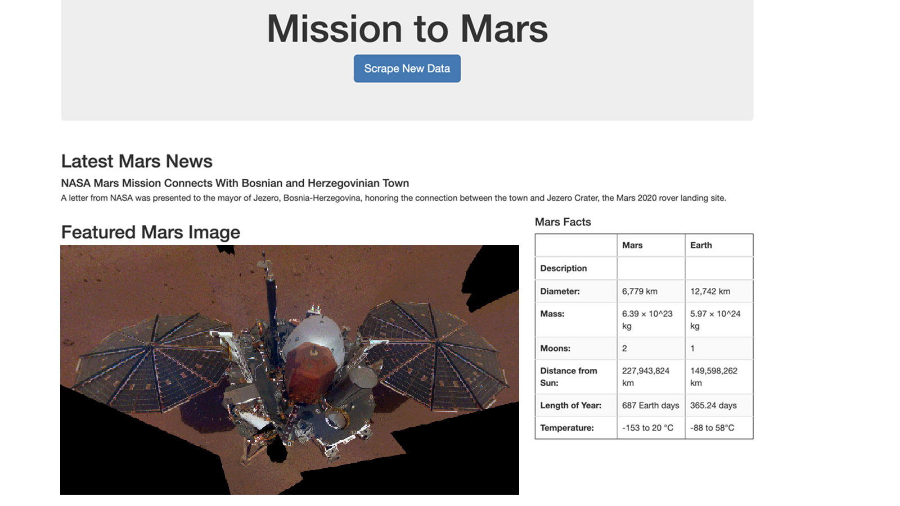

# Missing to Mars Web Scraping
Web scraping all sorts of data to using Splinter, Python, HTML and MongoDB to create an updating website using Flask.

Automate a Splinter browser to visit various Mars related websites to extract Mission to Mars data. Utilize NoSQL database by rendering data from Flask App.

Some tasks required in the process:
- Familiarize HTML elements and content identification for web scraping
- Automate Splinter browser and use BeautifulSoup to perform web scraping
- Upload data to MongoDB database and command Flask App to display data in a HTML/CSS markup dashboard 
- Utilize Bootstrap components to polish and customize the dashboard

A custom web scraped dashboard:

